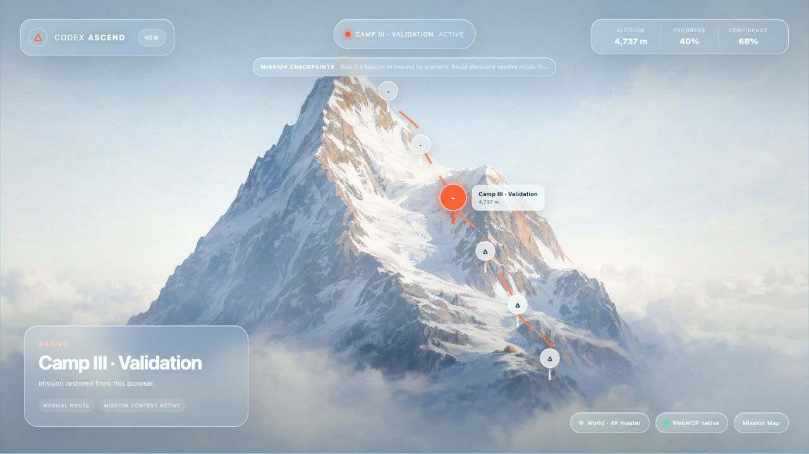
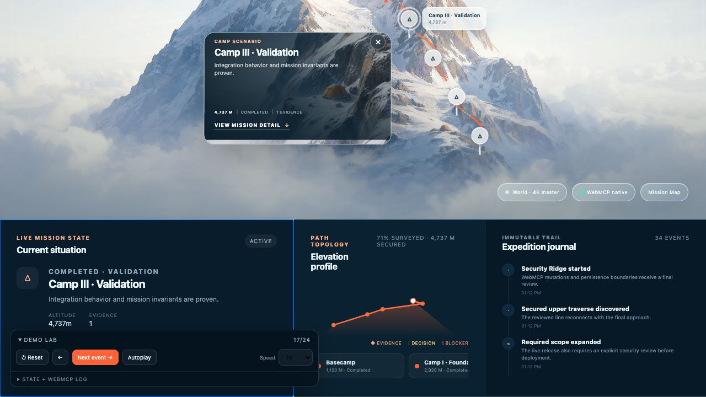

# Codex Ascend

**Codex Ascend turns one real goal into a live expedition shared by a human and an AI agent.** The mountain is not a progress bar. It is a shared execution model: camps are evidence-backed outcomes, fog is uncertainty, crevasses are blockers, route forks are consequential choices, and the Summit is available only after deterministic verification.

**Live demo:** use the deployment URL attached to the Devpost entry. Account-scoped hosting URLs are intentionally kept out of source control.



## Why WebMCP is essential

This is not a visual project tracker with tools bolted on. A WebMCP-capable agent reads and changes structured mission semantics through native `document.modelContext.registerTool` calls. Ascend projects those semantics into one persistent mountain.

The collaboration is bidirectional:

1. The agent discovers stages, records evidence, reports a real blocker and proposes two strategies.
2. The website becomes a route decision at that exact geography.
3. The human chooses **Repair persistence** inside the mountain card.
4. The agent reads the structured decision through WebMCP, resolves the blocker and continues.
5. Newly required work can reveal another ridge and change the understood ascent.
6. The Summit activates only when every required criterion has evidence.

## Product model

```text
Human UI / WebMCP agent / deterministic demo
                    ↓
          validated mission commands
                    ↓
Mission truth: stages, paths, blockers, decisions, evidence, journal
                    ↓
          neutral Mission Engine
                    ↓
          Ascend Experience Pack
      topology · narration · waypoint projection
                    ↓
generated/persistent mountain + deterministic live overlays
```

Rendering never mutates mission truth. The geometric Pixi Mission Map is an optional diagnostic view; the judged experience is the generated mountain, authored semantic atmosphere and accessible DOM interface.

## WebMCP surface

All 18 tools use closed JSON schemas, structured results and the same validated command engine as the human UI.

| Purpose | Tools |
| --- | --- |
| Inspect | `inspect_mission`, `inspect_human_decision` |
| Discover | `discover_mission`, `propose_stage`, `propose_path`, `expand_scope` |
| Execute | `begin_stage`, `record_progress`, `complete_stage`, `select_path`, `invalidate_stage` |
| Blockers and decisions | `report_obstacle`, `resolve_obstacle`, `request_human_decision` |
| Evidence and completion | `attach_evidence`, `verify_completion`, `complete_mission` |
| Project context | `submit_project_handoff` |

There is intentionally no agent tool for resolving a human decision. Consequential path authorization remains a human action in the website; `inspect_human_decision` exposes the result back to the agent.

See [WEBMCP_TOOLS.md](WEBMCP_TOOLS.md) for the complete contract.

## OpenAI and Cloudflare generation

The browser prepares a provider-neutral visual handoff; it never receives a provider credential.

```text
project handoff → mission/topology → Ascend prompt + waypoint anchors
  → authenticated Cloudflare Worker → Cloudflare Workflow
  → pinned GPT Image 2 snapshot → private R2 candidate
  → explicit review/acceptance → public generated world
```

- The accepted canonical mountain is a native 3840×2160 OpenAI generation.
- Derivatives are bound to the accepted master and deterministic waypoint crops.
- Failed requests retain provider request IDs and safe retry classification.
- Image retries require an explicit operator nonce; the system never retries into surprise spend.
- Only accepted generation-world assets are public. Authored semantic scenes remain presentation art and cannot mutate mission state.

See [PLATFORM_INTEGRATION.md](PLATFORM_INTEGRATION.md) and [MCP_GENERATION_HANDOFF.md](MCP_GENERATION_HANDOFF.md).

## Run locally

Requirements: Node.js 22+ and pnpm 10+.

```bash
pnpm install --frozen-lockfile
pnpm dev
```

Open `http://127.0.0.1:4173/`.

The frontend, deterministic journey and full test suite require no OpenAI or Cloudflare secret. Native WebMCP activates when `document.modelContext` is available; otherwise the app truthfully reports unsupported and simulation mode remains usable.

Run the complete local gate:

```bash
pnpm check
pnpm types:worker --check
```

## Cloudflare deployment

The Worker serves the Vite application and authenticated generation API. It binds:

- Cloudflare Workflows for bounded generation jobs;
- R2 for request, metadata, candidate image and accepted-world objects;
- static assets for the application and Camp II edit mask.

Deployment requires an existing Cloudflare project plus these server-side secrets:

- `OPENAI_API_KEY`
- `ASCEND_GENERATION_ADMIN_TOKEN`

Never place either value in browser environment variables, source files or commits. See [wrangler.jsonc](wrangler.jsonc) for non-secret bindings and [PLATFORM_INTEGRATION.md](PLATFORM_INTEGRATION.md) for the review boundary.

## Three-minute contest demo

Use normal mode for the recorded choreography:

1. Reset at Basecamp and inspect the mission.
2. Advance through Camp II to the persistence blocker.
3. Reveal two routes and let the human choose **Repair persistence**.
4. Show `inspect_human_decision` returning that choice.
5. Resolve the blocker, reveal Security Ridge and accumulate evidence.
6. Finish at the verified Summit.

Use `?present=1` to hide development controls or `?review=scenario-cards` to jump directly among the three critical Camp III visual states. The deterministic demo executes the same mission commands and cannot bypass evidence, blockers or the human-only decision.

See [CONTEST_DEMO_RUNBOOK.md](CONTEST_DEMO_RUNBOOK.md) and [CONTEST_VIDEO_SCRIPT.md](CONTEST_VIDEO_SCRIPT.md).

## Screenshots

| Blocker | Human route choice |
| --- | --- |
|  |  |
| **Mission detail and elevation profile** | **Verified Summit** |
|  |  |

## Security and scope

- OpenAI and administration credentials remain server-side.
- Every tool input is parsed again before domain execution.
- Tools accept no arbitrary code, file paths or credentials.
- Rendering is a disposable projection; validated mission state and its event journal are authoritative.
- Ascend is the only Experience Pack in this contest release.

## Release evidence

- [BUILD_STATUS.md](BUILD_STATUS.md) — exact automated and live verification evidence.
- [SUBMISSION_READINESS.md](SUBMISSION_READINESS.md) — submission gates and freeze status.
- [DEVPOST_SUBMISSION.md](DEVPOST_SUBMISSION.md) — proposed contest copy.

## License

MIT. See [LICENSE](LICENSE).
