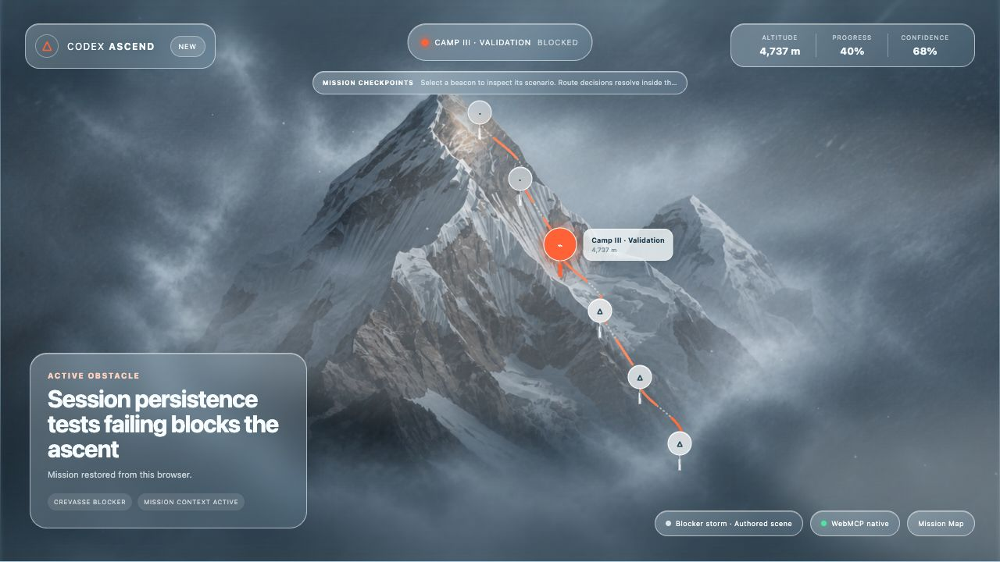
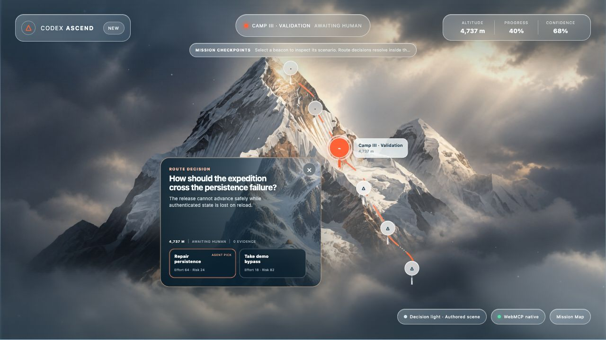
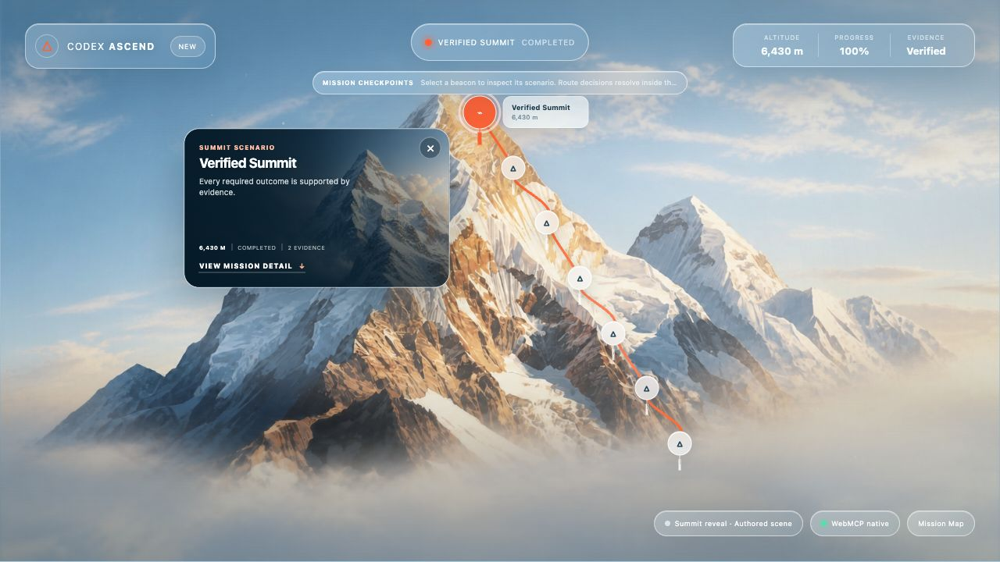

# Graybox Mission Map Handoff

All imagery below is the deterministic Pixi diagnostic Mission Map. It proves mission topology and state transitions only. It is not the production composition, a production fallback, final art, or evidence of deployment.

All production-art requirements in this document belong to the Ascend Experience Pack. They are not part of Mission Engine, WebMCP, persistence, decision, evidence, or event semantics. No additional Experience Pack should be designed or implemented during this visual pass.

The production direction is now an iconic illustrated whole-mountain, layered 2.5D expedition scene with a clouded silhouette cutoff and live transparent waypoint HUD. Topology chooses scenes and a project-length-aware waypoint spine invisibly; only the optional Mission Map may retain graph markers and route geometry. The exact artwork contract is [ASCEND_PRODUCTION_ASSET_SPEC.md](ASCEND_PRODUCTION_ASSET_SPEC.md).

## Captured states

### Basecamp and unknown terrain

Only the objective/basecamp is established; the upper mission remains uncharted.

### Blocking crevasse

A structured blocking test failure closes the validation route.

### Human route fork

Two semantic routes are visible while the human decision is pending.

### Reopened crossing

The chosen repair route becomes traversable after `resolve_obstacle`.

### Newly revealed ridge

Scope discovery adds Security Ridge above Camp III.

### Verified summit

All required criteria, dependencies, and evidence have passed deterministic verification.

The extracted PNGs preserve Pixi transparency and therefore preview against black in isolation. In the running app they sit over the blue atmospheric CSS sky.

## Diagnostic-only inventory

- geometric main/distant mountain planes;
- vector snow cap and shaded faces;
- curved route strokes;
- triangle tents and flags;
- text labels;
- translucent circle fog/cloud clusters;
- jagged crevasse stroke;
- route-fork beacon;
- new-ridge stroke;
- circular sky halo;
- point snow particles;
- geometric climber with seven semantic controller states.

## What the production renderer must avoid

- no full-mountain infographic as the primary view;
- no visible graph edges, geometric nodes, floating labels, or baked route line;
- no camps or blockers floating over terrain as markers;
- no circular fog clusters or line-only ridge discovery;
- no dense side panel competing with the current physical situation.

## Artwork intake order

1. approve one lower-route layered scene and the climber turnaround;
2. approve the matched open-crevasse/secured-crossing pair;
3. approve basecamp, camp, route fork, and ridge reveal scene kits;
4. approve final approach and summit continuity;
5. approve fog/weather atlases and scenario-card art;
6. populate the typed manifest only after every required slot passes review.

Do not generate other Experience Packs or substitute vector art. Wait for supplied reviewed artwork.
